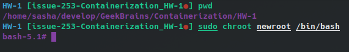
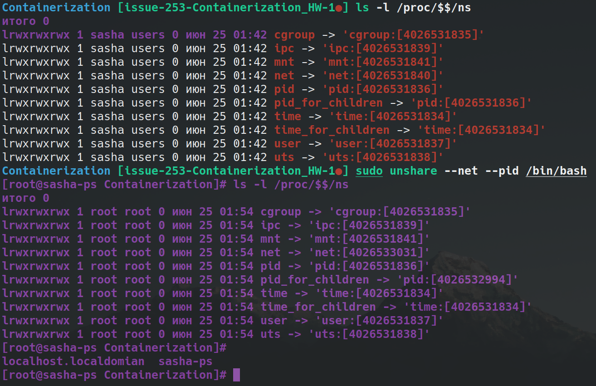

# Урок 1. Механизмы пространства имен

## 1. Сделать chroot для /bin/bash и перенести в новй корень программу ls

```sh
mkdir -p newroot/bin
cp /bin/bash ./newroot/bin
ldd /bin/bash
```

stdout:
```
linux-vdso.so.1 (0x00007ffe5e7f0000)
libreadline.so.8 => /usr/lib/libreadline.so.8 (0x00007f2f8bb8d000)
libc.so.6 => /usr/lib/libc.so.6 (0x00007f2f8b9a3000)
libncursesw.so.6 => /usr/lib/libncursesw.so.6 (0x00007f2f8b92c000)
/lib64/ld-linux-x86-64.so.2 => /usr/lib64/ld-linux-x86-64.so.2 (0x00007f2f8bd26000)
```

```sh
mkdir newroot/lib
mkdir newroot/lib64
cp /usr/lib/libreadline.so.8 newroot/lib
cp /usr/lib/libc.so.6 newroot/lib
cp /usr/lib/libncursesw.so.6 newroot/lib
cp /usr/lib64/ld-linux-x86-64.so.2 newroot/lib64

mkdir usr
cp -r lib* usr

sudo chroot newroot /bin/bash
whereis ls
mkdir newroot/usr/bin
cp /usr/bin/ls newroot/usr/bin

sudo chroot newroot /bin/bash

ldd /usr/bin/ls
```
stdout:
```
linux-vdso.so.1 (0x00007fffb831e000)
libcap.so.2 => /usr/lib/libcap.so.2 (0x00007f150e72b000)
libc.so.6 => /usr/lib/libc.so.6 (0x00007f150e541000)
/lib64/ld-linux-x86-64.so.2 => /usr/lib64/ld-linux-x86-64.so.2 (0x00007f150e78d000)
```
```sh
cp /usr/lib/libcap.so.2 newroot/usr/lib
cp /usr/lib/libc.so.6 newroot/usr/lib
cp /usr/lib64/ld-linux-x86-64.so.2 newroot/usr/lib64
sudo chroot newroot /bin/bash
```


---

## 2. Повторить последовательнсть комманд с ip как на семинаре. - Отлично

```sh
sudo ip netns add testns
sudo ip netns list
sudo ip netns exec testns bash
sudo ip link add veth0 type veth peer name veth1
sudo ip link set veth1 netns testns
ip netns list
sudo ip netns exec testns bash
sudo ip addr add 10.0.0.1/24 dev veth0
sudo ip link set dev veth0 up
sudo ip netns exec testns bash
ping 10.0.0.2
```

---

## 3. Повторить последовательнсть комманд с unshare как на семинаре. - Отлично

Формат сдачи ДЗ: предоставить доказательства выполнения задания посредством файла PDF или ссылки на google-документ с правами на комментирование/редактирование.
Результатом работы будет: текст объяснения, логи выполнения, история команд и скриншоты (важно придерживаться такой последовательности).
В названии работы должны быть указаны ФИ, номер группы и номер урока.и

```sh
ls -l /proc/$$/ns
sudo unshare --net --pid /bin/bash
```



---