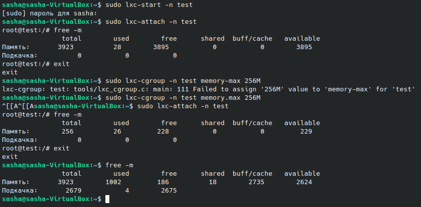

# Урок 2. Механизмы контрольных групп

## Задание 1:

запустить контейнер с ubuntu, используя механизм LXC
ограничить контейнер 256 Мб ОЗУ и проверить, что ограничение работает

---

```sh
sudo apt install cgroup-tools lxc debootstrap bridge-utils lxc-templates
sudo lxc-create -n test -t ubuntu
sudo lxc-start -n test
sudo lxc-cgroup -n test memory.max 256M
sudo lxc-attach -n test
```


