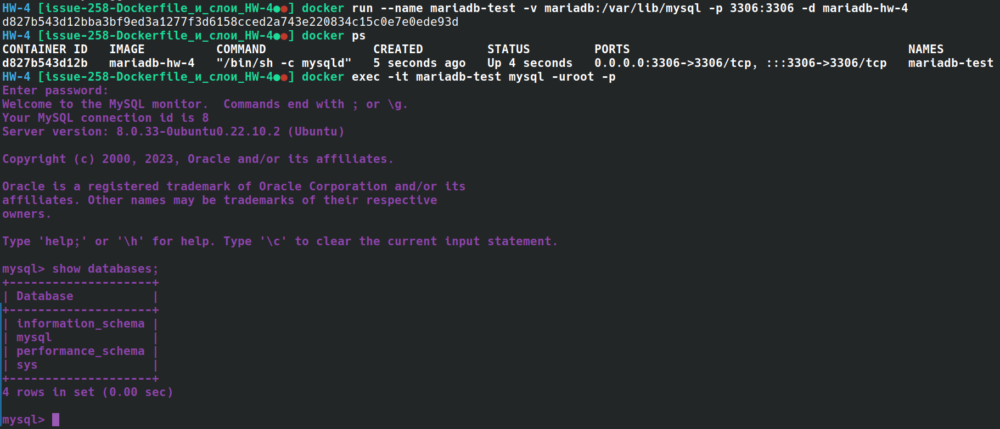

# Урок 4. Dockerfile и слои

## *5 (не обязательно). Сбилдить образ любой базы данных на основе alpine или debian/ubuntu. Запустить контейнер и проверить, что БД запустилась (допустим зайти через командную строку и вывести список баз данных).

>DockerFile:
>```Docker
>FROM ubuntu:22.10
>RUN apt-get update 
>RUN apt-get install -y mysql-server 
>EXPOSE 3306
>CMD mysqld
>```

```sh
docker build -t mariadb-hw-4 .
```


``` 
docker run --name mariadb-test -v mariadb:/var/lib/mysql -p 3306:3306 -d mariadb-hw-4
docker ps
docker exec -it mariadb-test mysql -uroot -p
```

