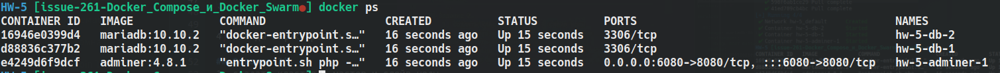
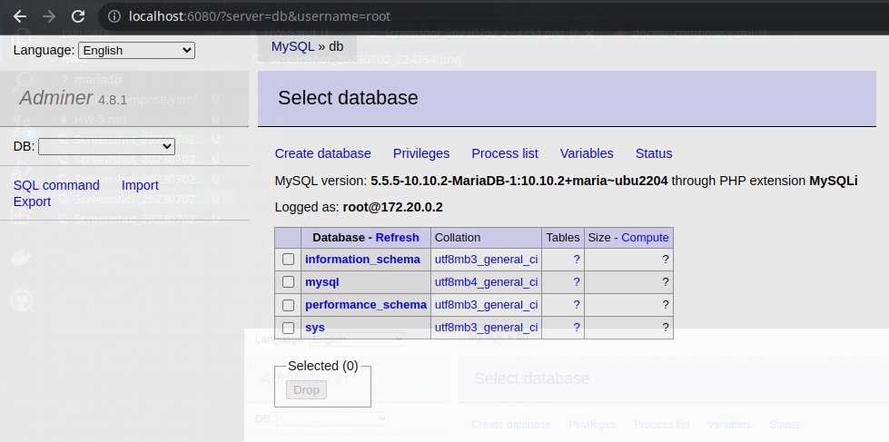

# Урок 5. Docker Compose и Docker Swarm

## Задание 1:
1) создать docker compose файл, состоящий из 2 различных контейнеров: 1 - веб, 2 - БД

```sh
mkdir mariadb
```

```yaml
version: '3.8'

services:

  db:
    image: mariadb:10.10.2
    environment:
      MYSQL_ROOT_PASSWORD: GB
    volumes:
      - /home/sasha/develop/GeekBrains/Containerization/HW-5/mariadb:/var/lib/mariadb
    deploy:
      mode: replicated
      replicas: 2

  adminer:
    image: adminer:4.8.1
    restart: always
    ports:
      - 6080:8080
    volumes:
      - /home/salerat/dumps:/dumps
    deploy:
      mode: replicated
      replicas: 1
```

2) запустить docker compose файл

```sh
docker compose up -d
```

3) по итогу на БД контейнере должно быть 2 реплики, на админере должна быть 1 реплика. Всего должно получиться 3 контейнера

```sh
docker ps
```



4) выводы зафиксировать




## Задание 2*:
1) создать кластер и мастер и слейв ноды

Master:
```sh
docker swarm init
docker node ls
```
Slave:
```sh
docker swarm join --token SWMTKN-1-2p63cvnjbv6btkk5mgzcofx5v5tthcvixq0ylhlrwsgaelnwv3-3nz
tme6bfg811qdgy4rdkwynv 172.17.0.3:2377
```


2) задеплоить на ноду несколько экземляров какого-нибудь контейнера, например nginx

Master:
```sh
docker service create --name nginx --label slave --replicas 4 nginx:alpine
docker ps
```

Slave:
```sh
docker ps
```

3) обязательно проверить и зафиксировать результаты, чтобы можно было выслать преподавателю для проверки


Задание со звездочкой - повышенной сложности, это нужно учесть при выполнении (но сделать его необходимо).

Формат сдачи ДЗ: предоставить доказательства выполнения задания посредством ссылки на google-документ с правами на комментирование/редактирование.
Результатом работы будет: текст объяснения, логи выполнения, история команд и скриншоты (важно придерживаться такой последовательности).
В названии работы должны быть указаны ФИ, номер группы и номер урока